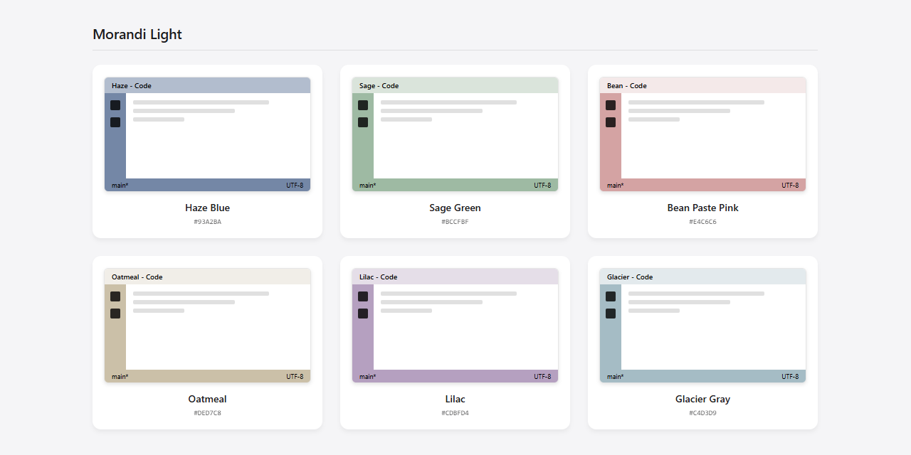

# Color Space

[English](README.md) | [中文](README.zh-CN.md)

**✨ Color Space** is a VS Code extension that automatically assigns a unique color to each of your workspaces. This helps you distinguish between different project windows at a glance.

###  Features

- 🎨 **Auto Coloring**: Automatically selects the perfect configuration for your workspace to bring you a surprise.
- 🎨 **Creative Mode**: Use the new interactive color picker to create your own unique theme with real-time preview.
- 🏛️ **Theme Treasury**: Features a collection of elegant color schemes, including Morandi Dark/Light themes and Chinese Dunhuang colors—there's always one for you!
- 🖱️ **Status Bar Interaction**: Click the "Palette" icon in the status bar to switch themes in seconds.
- 🎲 **Manually Select**: Want to be creative? Manually pick a color or use `Surprise Me` mode to shake things up.
- ⚙️ **Configurable**: Toggle globally as you wish, or add workspaces you want to "leave alone" to the ignore list—giving you full control.

### Commands

- `Color Space: Enable` - Enable auto setting workspace theme.
- `Color Space: Disable` - Disable auto setting workspace theme.
- `Color Space: Color Theme` - Show system preset color themes.
- `Color Space: Pick Color` - Quickly select from the theme list.
- `Color Space: Surprise Me` - Randomly select a theme.
- `Color Space: Clear Color` - Clear current workspace theme color.

### Extension Settings

This extension contributes the following settings:

* `colorspace.enabled`: Enable/disable the extension.
* `colorspace.ignoreList`: List of workspace names to ignore.

### License

[MIT](LICENSE)
